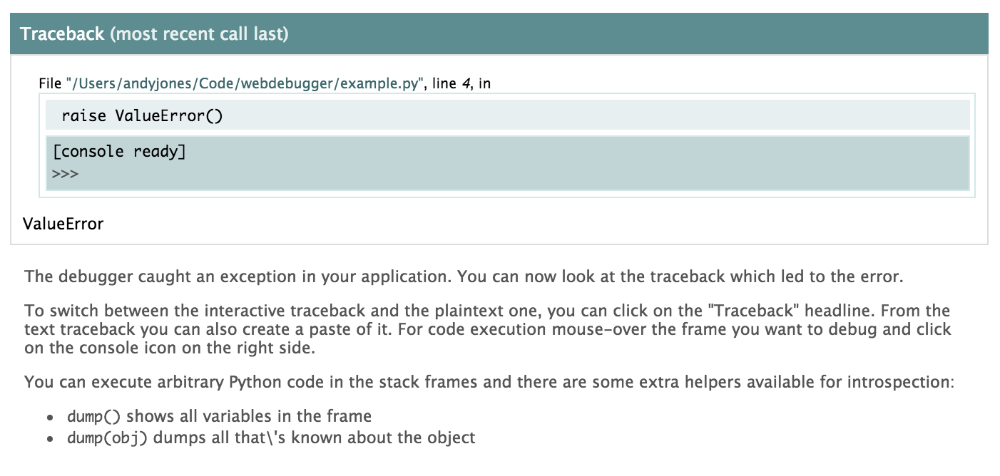

**NEVER RUN THIS ON A PUBLIC PORT. ANYONE WHO HAS ACCESS TO IT CAN RUN ARBITRARY CODE ON THE HOST COMPUTER**

This is a remote debugger for Python with a web interface. It is based on the fantastic [Werkzeug debugger](https://github.com/pallets/werkzeug).

To use it, call `webpdb.pm(host, port)` from inside an `except` block. It'll launch a web server at the given host and port, which you can access at `host:port/debugger`. You should get a webpage like this:

which displays the most recent error, and lets you create a console anywhere on that error's stack.

See [example.py](example.py) for an example of how to use it.

### TODO
  * Add password/token authentication like Werkzeug has.
  * Replace the underlying REPL with something that calls out to ipython
  * Add syntax highlighting of some sort
